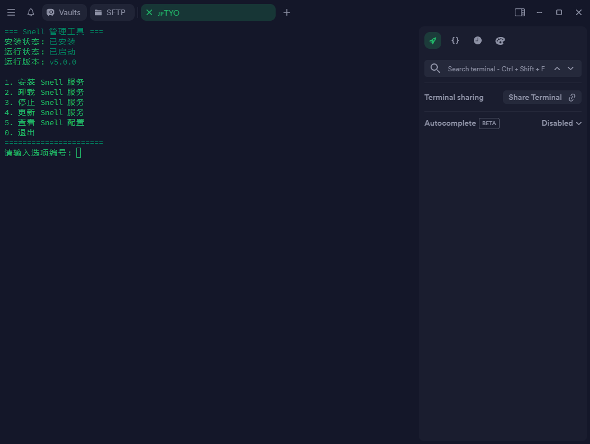

## 终端预览




## 一键脚本

```
bash <(curl -fsSL snell-ten.vercel.app)
```

## 详细说明

- 执行脚本即可自动部署 Snell 代理服务器

- 脚本会生成随机端口和 PSK 并配置在 Snell 服务器中

- 执行完脚本后，你会得到客户端配置 url 方便快速设置

## 常用指令

| 命令                                     | 说明               |
|------------------------------------------|--------------------|
| `sudo systemctl stop snell`              | 停止 Snell 服务     |
| `sudo systemctl start snell`             | 启动 Snell 服务     |
| `sudo systemctl restart snell`           | 重启 Snell 状态     |
| `sudo systemctl status snell`            | 查看 Snell 服务     |
| `sudo journalctl -u snell.service -f`    | 查看 Snell 日志     |
| `sudo cat /etc/snell/snell-server.conf`  | 查看 Snell 配置     |
| `sudo vim /etc/snell/snell-server.conf`  | 修改 Snell 配置     |


## 项目地址：[https://kb.nssurge.com](https://kb.nssurge.com/surge-knowledge-base/zh/release-notes/snell)

## 服务器赞助商(仅接受长期稳定运营，信誉良好的商家)

| 赞助商 | 商标 | 网址 | 专属优惠码 |
| - | - | - | - |
| PQS |  | [https://www.pqs.pw](https://www.pqs.pw/aff.php?aff=661) | 月缴：PQS-PASSEWAY-MON（9.1折）<br>季缴：PQS-PASSEWAY-SEA（8.3折）<br>半年：PQS-PASSEWAY-HAF（7.9折）<br>一年：PQS-PASSEWAY-YEA（7.3折） |


