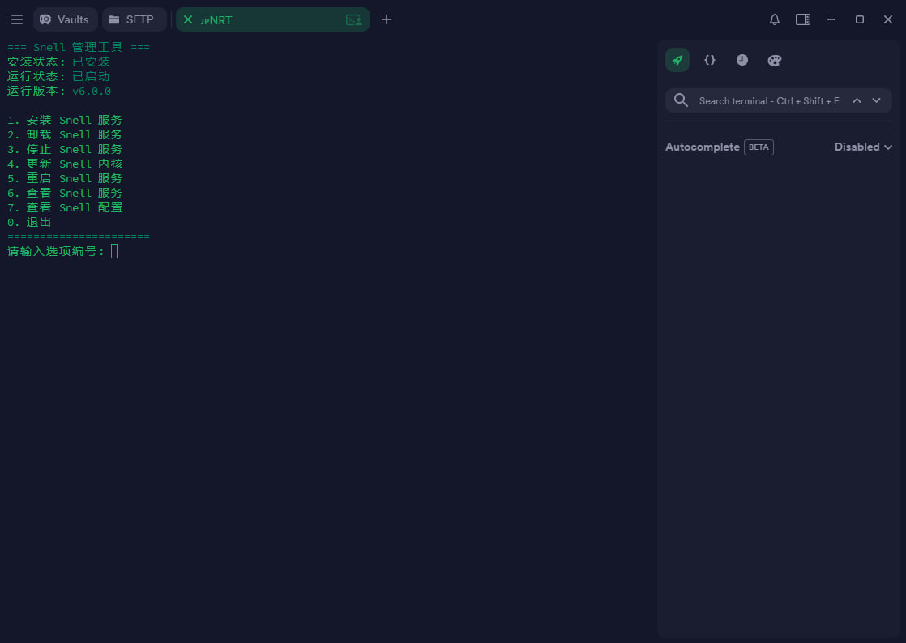

## 终端预览




## 一键脚本

```
bash <(curl -fsSL snell-ten.vercel.app)
```
# Snell

Snell is a lean crypto proxy protocol developed by the Surge team. Here are some highlights:

* Extreme performance.
* Support UDP over TCP relay.
* Single binary with zero dependencies. (except glibc)
* A wizard to help you start.
* Proxy server will report remote errors to the client if an error encounters. Clients may choose countermeasures for different scenarios.
# Snell v6
```
For encrypted proxy protocols, there are broadly two approaches to reducing protocol identifiability.

The first approach is to minimize protocol-specific structure and expose as little recognizable metadata as possible. Traditional encrypted proxy protocols generally fall into this category.

As mentioned above, a purely encrypted protocol produces a high-entropy random data stream. Ironically, the absence of obvious structure can become a structure of its own. This characteristic is already known to be detectable, which is why the design space around encrypted proxy protocols has continued to evolve.

The second approach is to make the protocol closely resemble a common protocol, such as TLS. Many newer proxy protocols have explored this direction, and there are already several excellent projects in this area.

Snell v6 takes a different path.

It does not attempt to impersonate TLS or any other existing protocol. Instead, Snell v6 moves from a single protocol-level traffic pattern to PSK-derived deployment-level diversity.

In Snell v4, all deployments shared the same general protocol behavior, including the same category of randomized perturbation. Snell v6 changes this model by generating a deployment-specific protocol profile.

More specifically, Snell v6 operates based on a protocol profile. This profile contains 42 characteristic parameters and 13 categories of padding and traffic-shaping strategies that can be combined in different ways. These parameters control multiple observable aspects of the encrypted stream, including framing behavior, padding behavior, packet-size distribution, and traffic normalization.

A sample profile looks like this:

static const sn_shape_profile_t sample_profile = {
    .profile_id = 0x6a31c4d2,

    .pre_salt_min = 37,
    .pre_salt_max = 91,
    .salt_permutation_rounds = 5,
    .salt_mask_stride = 11,

    .header_prefix_min = 12,
    .header_prefix_max = 44,

    .padding_generator = SN_SHAPE_PAD_GEN_BLOCK_MIXTURE,
    .padding_min = 48,
    .padding_max = 220,
    .padding_chunk_count = 4,
    .padding_interval = 3,
    .padding_small_payload_limit = 384,

    .bit_ratio_min = 86,
    .bit_ratio_max = 132,

    .histogram_low_weight = 38,
    .histogram_mid_weight = 146,
    .histogram_high_weight = 73,
    .nibble_low_mask = 0x5b,
    .block_motif_count = 5,
    .block_repeat_window = 17,

    .mix_mode = SN_SHAPE_MIX_OFFSET_STRIDE_SWAP,
    .mix_rounds = 3,
    .mix_stride = 19,
    .mix_offset = 7,
    .mix_block_size = 11,

    .chunk_policy = SN_SHAPE_CHUNK_BUCKETED,
    .chunk_initial_size = 612,
    .chunk_max_size = 4096,
    .chunk_growth_step = 431,
    .chunk_jitter = 96,
    .chunk_bucket_count = 5,
    .chunk_buckets = {
        517, 863, 1291, 2047, 3079
    },
    .idle_reset_seconds = 8,

    .write_policy = SN_SHAPE_WRITE_FIXED_SEQUENCE,
    .first_write_count = 5,
    .write_bucket_count = 5,
    .write_buckets = {
        233, 377, 610, 987, 1597
    },
    .write_sequence_count = 6,
    .write_sequence = {
        233, 610, 377, 987, 610, 1597
    },
    .write_jitter = 64,
    .write_payload_factor = 3,
};
Different profiles result in different observable traffic characteristics. As long as different servers use different profiles, there is no longer a single stable traffic pattern shared by all Snell v6 deployments.

This significantly increases the cost of protocol classification. Instead of matching one fixed protocol fingerprint, a classifier would need to account for a large number of deployment-specific behaviors.

Auto-configuration
At the same time, users do not need to manually configure or tune these complex profiles. The Snell v6 client and server automatically derive the protocol profile from the configured PSK.

In other words, as long as the PSK is different, the resulting protocol characteristics will also be different.

This design has two important benefits.

First, it keeps deployment simple. Users can continue to configure Snell in a familiar way without learning or maintaining a large number of low-level protocol parameters.

Second, it prevents profile homogenization. If users had to manually choose or copy protocol profiles, many deployments would inevitably end up sharing the same configuration, which would defeat the purpose of fingerprint diversity. By deriving the profile automatically from the PSK, Snell v6 ensures that deployments naturally diverge from one another.

With Snell v6, our goal is not to imitate a specific existing protocol. Instead, Snell v6 introduces controlled protocol diversity at the deployment level, while preserving Snell’s long-standing priorities: performance, deployment simplicity, accurate error reporting, and full TCP semantics.

More Features
This release adds more flexible network stack control capabilities to the server. First, a new dns-ip-preference configuration item has been added, allowing an IP address family preference to be specified when using DNS resolution results. It supports five modes: default, prefer-ipv4, prefer-ipv6, ipv4-only, and ipv6-only, making it easier to stably control connection behavior in dual-stack networks, IPv6-preferred networks, or environments with only IPv4/IPv6 egress.

Second, listen now supports configuring multiple listening addresses simultaneously, for example, listen = 0.0.0.0:7177,[::]:7177, so the server can explicitly listen on both IPv4 and IPv6 addresses at the same time, without relying on the system’s compatibility behavior for IPv6 sockets. The new --help has also been updated with the relevant configuration descriptions.
```
## 常用指令
```
[server_main] <NOTIFY> snell-server v6.0.0b1 (Jun 12 2026)
Usage: /usr/local/bin/snell-server [-v] [--help] [--license] [--wizard] [--systemd] [-l log level] [-c config]
An encrypted proxy service.

  --help                    display this help and exit
  -v, --version             display version info and exit
  --license                 display license info and exit
  --wizard                  use wizard to create a new server config
  --systemd                 use systemd socket activation
  -l, --loglevel=log level  set log level
  -c config                 config file

Config file parameters ([snell-server]):
  listen                    TCP listen address list. Format: host:port or [ipv6]:port. Multiple addresses can be separated by commas.
                            Example: listen = 0.0.0.0:7177,[::]:7177
  psk                       Pre-shared key. Required. Length must be between 16 and 255 bytes.
  dns                       Custom DNS server list separated by commas. Supports IPv4 and IPv6 server addresses.
  dns-ip-preference         DNS result IP preference: default, prefer-ipv4, prefer-ipv6, ipv4-only, ipv6-only.
  ipv-preference            Alias of dns-ip-preference.
  ipv6                      Deprecated compatibility option. false maps to ipv4-only; true maps to default unless dns-ip-preference is set.
  egress-interface          Bind outgoing TCP, UDP, and DNS sockets to the named network interface

```

## 项目地址：https://kb.nssurge.com/surge-knowledge-base/release-notes/snell


