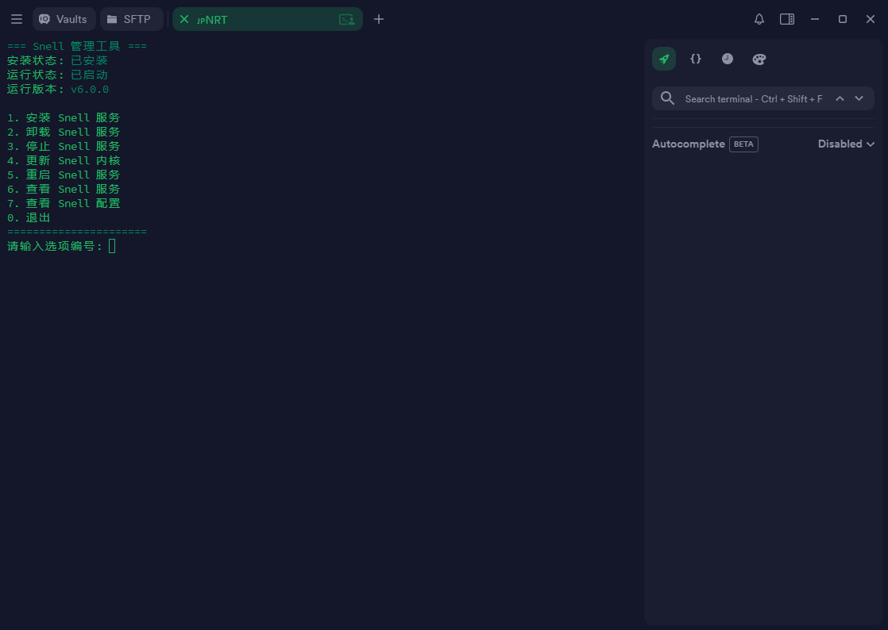

# 🚀 Snell Proxy Installer

<div align="center">
  
  
  
  
</div>

<p align="center">
  <b>A minimalist, high-performance Snell proxy server one-click deployment script.</b>
  <br />
  <b>English</b> | <a href="README_zh.md">简体中文</a>
</p>

---

## ✨ Terminal Preview



## ⚡ Quick Install

Run the following command in your terminal to start the installation:

```bash
bash <(curl -fsSL snell-ten.vercel.app)
```

On Alpine, first install Bash and curl, then run the installer from Bash:

```sh
apk add --no-cache bash curl ca-certificates
bash -c 'bash <(curl -fsSL https://snell-ten.vercel.app)'
```

The main script installs its remaining Alpine dependencies automatically. Alpine logs are stored in `/var/log/snell.log`. The Docker script is unchanged.

## 🌟 Key Features

Snell is a lean encrypted proxy protocol developed by our team. Here are some highlights:

* Extreme performance.
* Support UDP over TCP relay.
* Single binary with zero dependencies. (except glibc)
* A wizard to help you start.
* Proxy server will report remote errors to the client if an error encounters. Clients may choose countermeasures for different scenarios.

## 📦 Supported Environments

The main script targets the following systems (amd64 / aarch64):

- Debian / Ubuntu with systemd
- Alpine with OpenRC, gcompat and libstdc++

## Maintenance

- Install/update applies `root:snell 640` to the server configuration and `root:root 600` to the client configuration.
- Menu **8** regenerates the client entry from the current server port, PSK and mode, preserving its existing valid IPv4 address and node name. Restart the service after editing the server configuration to activate changes.
- Public IPv4 lookup uses HTTPS, connection/total timeouts and fallback providers. If all providers fail, enter the address manually; cancel with an empty line and retry from menu **8**.
- On Alpine, an hourly job rotates `/var/log/snell.log` when it exceeds 1 MiB, retaining up to 3 compressed archives. The log can grow between checks. Configuration lives at `/etc/snell/logrotate.conf`; `copytruncate` keeps the log writable, with a small possible loss window between copying and truncation.
- Press **Ctrl+C** in live logs to return to the menu.

For existing installations, run the latest script and choose **4 (update)** to apply log rotation and configuration permissions. Binary updates do not create backups.

Developer checks: `python3 -m unittest discover -s tests -v`. GitHub Actions runs syntax and regression checks in Debian, Ubuntu and Alpine containers. Tests use temporary directories and mocked service commands; they do not replace end-to-end VPS tests.

## 🛠️ Configuration Guide

Server config file path: `/etc/snell/snell-server.conf`

```ini
[snell-server]
listen = 0.0.0.0:7177,[::]:7177    # TCP listen addresses (comma-separated)
psk = your_pre_shared_key          # Pre-shared key (16 - 255 bytes)
# Operating mode. Ensure server and client modes are consistent:
# - default: Enables traffic obfuscation and AES encryption.
# - unshaped: Disables obfuscation, AES only (10% faster).
# - unsafe-raw: No encryption or obfuscation (secure environments only).
mode = default                     
dns-ip-preference = default        # Options: default, prefer-ipv4, prefer-ipv6, ipv4-only, ipv6-only
egress-interface = eth0            # (Optional) Bind outgoing sockets to an interface
```

## 📚 References
- Official Release Notes: [Snell V6 Release Notes](https://kb.nssurge.com/surge-knowledge-base/release-notes/snell)
- Snell is a lightweight proxy protocol developed by the [Surge Team](https://kb.nssurge.com/surge-knowledge-base).
